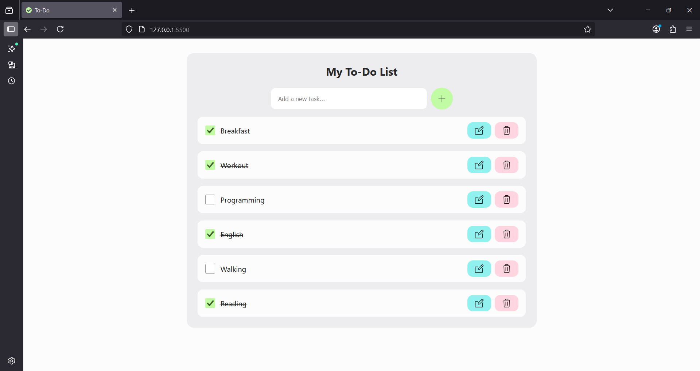

# 📝 To-Do App

A simple **To-Do list** built with vanilla **HTML, CSS, and JavaScript**.

---

## 🔗 Live Demo

👉
[https://anna010622.github.io/vanilla-todo/](https://anna010622.github.io/vanilla-todo/)

---

## ✨ Features

- ➕ Add new tasks
- ✅ Mark tasks as complete
- 📝 Edit tasks in a dialog window
- ❌ Delete tasks
- ↕️ Drag-and-drop task reordering

---

## 🛠️ Tech Stack

- **HTML5** – semantic structure
- **CSS3** – responsive design
- **JavaScript (ES6+)** – DOM manipulation, events, localStorage API

---

## 📸 Screenshots

