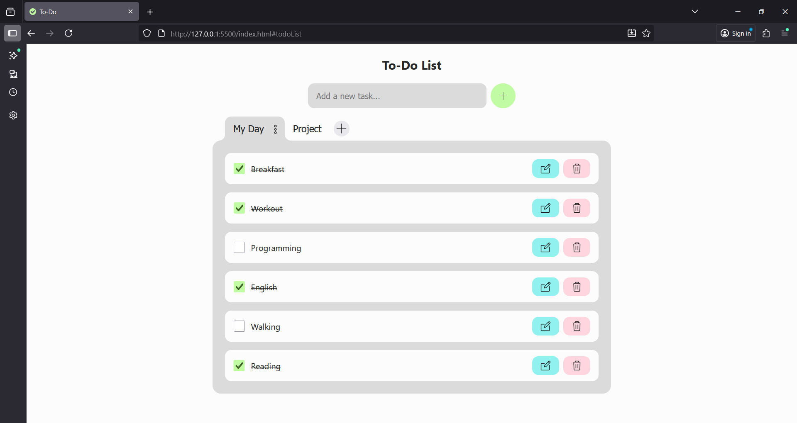

# 📝 To-Do App

A minimalistic **To-Do** web application built with vanilla **HTML, CSS, and
JavaScript**.

---

## 🔗 Live Demo

👉
[https://anna010622.github.io/vanilla-todo/](https://anna010622.github.io/vanilla-todo/)

---

## ✨ Features

✅ Tasks

- ➕ Add new tasks to the active list
- ✅ Mark tasks as complete / incomplete
- 📝 Edit tasks
- ❌ Delete tasks
- ↕️ Drag-and-drop task reordering

🗂️ Lists

- ➕ Create multiple to-do lists
- 📝 Rename lists
- ❌ delete lists
- 💾 Automatically saves lists to localStorage

## 🛠️ Tech Stack

- **HTML5** – semantic structure
- **CSS3** – responsive layout, modular styles
- **JavaScript (ES6+)** – dynamic UI, modules, localStorage API

---

## 📸 Screenshots

